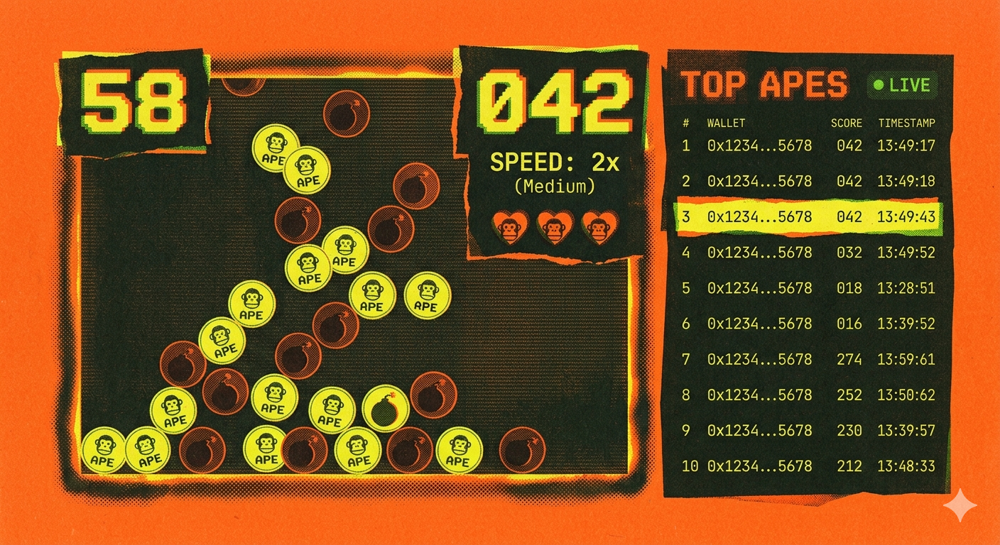

# 🦍 ReactApe — Bored Ape Blitz on Somnia

> Catch falling apes, dodge bombs, submit your high score onchain — powered by real-time Somnia Reactivity.



<p align="center">
  <a href="#"><strong>🌐 Website</strong></a> ·
  <a href="#"><strong>🎬 Demo Video</strong></a> ·
  <a href="#"><strong>📊 Pitch Deck</strong></a>
</p>

---

## Deployed Contract Addresses

| Network | Address | Explorer |
|---|---|---|
| **Somnia Testnet** (50312) | `0x6Ff8A142F4909d5ef59C59b28Ccd1184E95F477A` | [View on Explorer](https://somnia-testnet.socialscan.io/address/0x6Ff8A142F4909d5ef59C59b28Ccd1184E95F477A) |

---

## What is ReactApe?

**ReactApe** is an onchain arcade game built on the **Somnia Testnet**. Players catch falling apes, dodge bombs, and submit high scores to a smart contract. The leaderboard updates in real-time using **Somnia Reactivity** — a native push-based event system that eliminates polling.

### The Problem

Traditional onchain games rely on polling RPCs to detect state changes. This creates latency, wastes resources, and delivers a sluggish user experience that can't compete with centralized games.

### The Solution

ReactApe uses **Somnia Reactivity** to push `ScoreSubmitted` events directly to the browser via WebSocket the instant they land onchain. The leaderboard reflects new scores in ~100ms — not 5-10 seconds — with zero RPC polling overhead.

---

## Features

| Feature | Description |
|---|---|
| **Onchain Scores** | Every submitted score is recorded in the `ReactApeGame` smart contract |
| **Name Registration** | Register a display name for a +1 point bonus on every submission |
| **Real-Time Leaderboard** | Push-based `ScoreSubmitted` event subscriptions via Somnia Reactivity |
| **Wallet Gating** | Connect wallet on Somnia Testnet to play |
| **Combo System** | 5 consecutive ape clicks activate a 2x multiplier for 5 seconds |
| **Speed Scaling** | Falling speed increases by 40% every 30 seconds (3 tiers) |
| **Risograph Aesthetic** | Punk-zine inspired UI with halftone textures, torn-paper panels, CRT scanlines |

---

## Tech Stack

| Layer | Technology |
|---|---|
| **Frontend** | Next.js 15, React 19, TypeScript, Tailwind CSS 3 |
| **Wallet** | RainbowKit 2, wagmi 2, viem 2 |
| **Real-Time** | `@somnia-chain/reactivity` SDK (WebSocket push) |
| **Smart Contract** | Solidity 0.8.24, Foundry |
| **Chain** | Somnia Testnet (EVM, Chain ID 50312) |

---

## Getting Started

### Prerequisites

- **Node.js** ≥ 18
- **Foundry** — [install](https://book.getfoundry.sh/getting-started/installation)
- Wallet with SOM testnet tokens — [Faucet](https://docs.somnia.network/developer/network-info)
- **WalletConnect Project ID** — [cloud.walletconnect.com](https://cloud.walletconnect.com)

### 1. Deploy the Smart Contract

```bash
cd contracts
forge install
forge test -vvv

export PRIVATE_KEY=0xYourPrivateKeyHere
forge script script/Deploy.s.sol:DeployReactApeGame \
  --rpc-url https://dream-rpc.somnia.network \
  --broadcast -vvvv
```

Note the deployed address from the output.

### 2. Run the Frontend

```bash
cd frontend
npm install
cp .env.example .env.local
```

Edit `.env.local`:
```
NEXT_PUBLIC_WC_PROJECT_ID=<your WalletConnect project ID>
NEXT_PUBLIC_CONTRACT_ADDRESS=<deployed contract address>
```

```bash
npm run dev
```

Open [http://localhost:3000](http://localhost:3000).

---

## Environment Variables

| Variable | Location | Description |
|---|---|---|
| `NEXT_PUBLIC_WC_PROJECT_ID` | `frontend/.env.local` | WalletConnect Cloud project ID |
| `NEXT_PUBLIC_CONTRACT_ADDRESS` | `frontend/.env.local` | Deployed ReactApeGame contract address |
| `PRIVATE_KEY` | Shell env (never commit) | Deployer wallet private key |

---

## Somnia Testnet

| Parameter | Value |
|---|---|
| Chain ID | `50312` |
| RPC | `https://dream-rpc.somnia.network` |
| WebSocket | `wss://dream-rpc.somnia.network/ws` |
| Explorer | `https://somnia-testnet.socialscan.io` |
| Currency | SOM |

---

## Documentation

- [Frontend Guide](frontend/README.md) — setup, structure, components
- [Smart Contracts](contracts/README.md) — contract details, testing, deployment
- [Architecture](ARCHITECTURE.md) — system design, data flow, reactivity integration

---

## License

MIT
